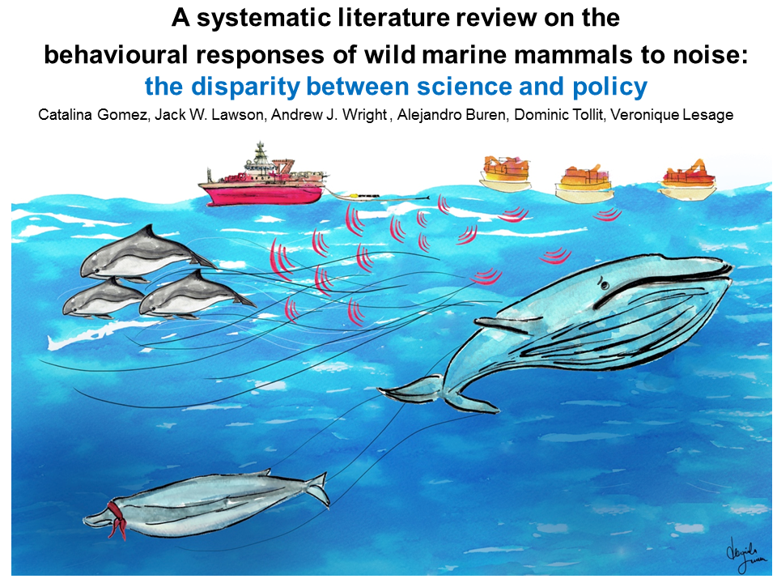

# Supplementary material 2

This interactive supplementary material (S2) allows to download and display the publications and data cases included in the systematic review on the behavioural responses of wild marine mammals to noise. 

You can access the supplementary in different ways

Option 1
```R
#Open R and read the following code
library(shiny)
library(shiny)
library(shinythemes)
library(shiny)
library (ggplot2)
library(plyr)
library(sm)
library(datasets)
library(markdown)
library(shinyBS)
library(shinythemes)
# Easiest way is to use runGitHub
runGitHub("BRS_S2", "gomezcatalina")
```
Option 2 
```R
# First clone the repository with git. If you have cloned it into
# ~/BRS_S2, first go to that directory, then use runApp().
setwd("~/BRS_S2")
runApp()
```
Option 3
```R
Follow this link: https://catalinagomez.shinyapps.io/BRSApp/
```

***


*Illustration by http://www.danielalucia.com/ *

***

**ABSTRACT**

C. Gomez (1), J.W. Lawson (1), A.J. Wright (2), A. Buren (1), D. Tollit (3), and V. Lesage (4)

1) Department of Fisheries and Oceans (DFO), Marine Mammal Section, Northwest Atlantic Fisheries Centre, St. John’s, Newfoundland and Labrador, Canada, A1C 5X1. 
2) Department of Environmental Science and Policy, George Mason University, 4400 University Dr, Fairfax, VA 22030. 
3) SMRU Consulting North America, 510-1529 6th Avenue West, Vancouver, British Columbia, Canada.
4) DFO, Maurice Lamontagne Institute, DFO, Mont-Joli, Quebec, Canada, G5H 3Z4.

*Corresponding author: C. Gomez. Current mailing address: Department of Fisheries and Oceans, Ocean and Ecosystem Sciences Division, Bedford Institute of Oceanography, Dartmouth, Nova Scotia, Canada, A1C 5X1. e-mail: Catalina.Gomez@dfo-mpo.gc.ca*

**Abstract**

Noise can cause marine mammals to interrupt their feeding, alter their vocalizations, or leave important habitat, among other behavioural responses. The current North American paradigm for regulating activities that may result in behavioural responses identifies received sound levels (RL), at which individuals are predicted to display significant behavioural responses (often termed harassment). The recurrent conclusion about the need for considering context of exposure, in addition to RL, when assessing probability and severity of behavioural responses led us to conduct a systematic literature review (370 papers) and analysis (79 studies, 195 data cases). The review summarized the critical and complex role of context of exposure. The analysis emphasized that behavioural responses in cetaceans (measured via a linear severity scale) were best explained by the interaction between sound source (continuous, sonar or seismic/explosion) and functional hearing group (a proxy for hearing capabilities). Importantly, more severe behavioural responses were not consistently associated with higher RL, and vice versa. This indicates that monitoring and regulation of acoustic effects from activities on cetacean behaviour should not exclusively rely upon generic multi-species RL thresholds. We recommend replacing the behavioural response severity score with a response/no response dichotomous approach that can represent a measure of impact in terms of habitat loss and degradation.
